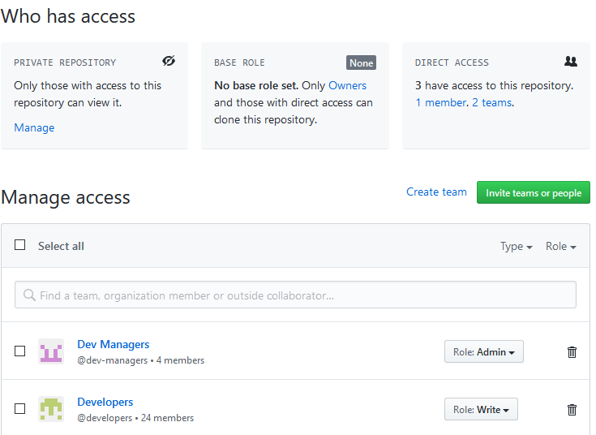

# CREATE A NEW TAOTI WORDPRESS CI SITE

Note that creating a new site has more [requirements](requirements-new-site.md) than developing an existing site.

## Initialize Local Site Repository

- Clone the [base repository](https://github.com/Taoti/wordpress-ci) to your computer to a new folder. Use the clone command
to place your new site in a folder to match the name you're about to use for \[NEW-MACHINE-SITE-NAME\] below.

```bash
git clone https://github.com/Taoti/wordpress-ci.git my-new-site
```

or

```bash
git clone git@github.com:Taoti/wordpress-ci.git my-new-site
```

## Get the Base Theme

- Prior to spinning up the new theme, you need to get the 
- **Note:** This will be revised in later versions to `git clone` as part of the build process.

**Make sure it clones the 

```bash
git clone https://github.com/Taoti/taoti-wp-base.git web/wp-content/themes/taoti-wp-base
```

or

```bash
git clone git@github.com:Taoti/taoti-wp-base.git web/wp-content/themes/taoti-wp-base
```

## Initializing Your New Site

- Run the following command to get everything started with Taoti's WP Base theme, Slack, GitHub, CircleCI and Pantheon:

```bash
cd my-new-site
git clone git@github.com:Taoti/taoti-wp-base.git web/wp-content/themes/taoti-base-theme
composer setup-new-site
```

(For Username/password `git clone`, use `https://github.com/Taoti/taoti-wp-base.git`)

and follow prompts.

## Setting up Slack Integration Commands

- **Note:** This step only generates the _commands_ for Slack Integration. To finish setup, move to **Slack Notices** below to look into creation of the `SLACK_WEBHOOK` environment variable.
- **IF** the `pantheon.yml` file does not properly generate, navigate back to docroot and run the following command from docroot:

```bash
composer setup-slack
```

## Post Creation steps

- Edit `.lando.yml` and change the site ID to your new site ID from Pantheon (long UUID type string)

- Update the title of the `README.md` to show that this is a specific site, not the base code.

- Initialize your local Lando instance for this site - for more details see the [primary readme](../README.md) - you
can pull the installed database from pantheon via:

```bash
lando pull --database=dev --files=none --code=none
```

- Make the repository private:
  - go to your new repository (which will have an url like `https://github.com/Taoti/NEW-SITE-MACHINE-NAME`).
  - Click the `settings` tab near the top.
  - Scroll alllll the way down, and click `Make Private` in the Danger Zone and follow prompts.

- Adjust permissions for the project.
  - go to `https://github.com/Taoti/NEW-SITE-MACHINE-NAME/settings/access` (well with your site's url).
  - click `Invite teams or people`
    - Add the `developers` team with the permission level `write`
    - Add the `dev-managers` team with the permission level `admin`
  - Permissions should look approximately like this:

  

## Slack Notices

**Note:** For the most up-to-date version of these instructions, see https://tu.taoti.com/knowledge-base/200-setting-up-the-circle-ci-slack-notification-integration-for-your-project/.

- Taoti uses the `3.4.2` version of the 'Slack Orb'.

**Setting Up:**

1. Navigate to https://taoticreative.slack.com/apps/A0F7VRE7N-circleci
2. Step 1 - Slack Setup
   1. Slick `"Add to Slack"`.
   2. Follow along the instructions with these settings:
      1. **Post to Channel:** `[choose correct channel from dropdown]`
      2. **Webhook URL:** `[automatically generated]` **Make a copy of this URL. You will need it later!**
      3. **Descriptive Label:** `[Project Name] Circle CI Notifications`
      4. **Customize Name:** `Circle CI`
      5. **Customize Icon:** `Circle CI Logo should automatically be loaded in here]`
3. Step 2 - Circle CI Setup
   1. Navigate to https://circleci.com/gh/Taoti
   2. Find the project you created and open `Project Settings`.
   3. Click `"Add Environment Variables"`.
      1. **Name:** `SLACK_WEBHOOK`
      2. **Value:** `[Paste the copied webhook URL]`
4. Step 3 - Project Code Setup
   1. This is already done! Congrats!
