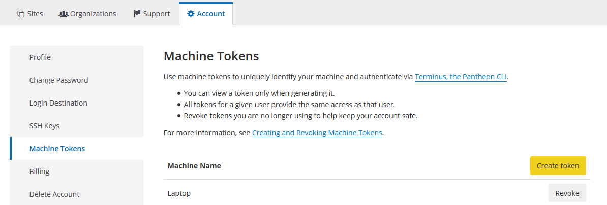

# REQUIREMENTS FOR SITE CREATORS
In addition to the minimal requirements for developing with Lando, creating new sites on Pantheon with full CI requires
a few more tools available locally. Note that Terminus itself is **unsupported** on Windows so your mileage on that may
vary - at minimum you would also need to install a sed replacement, since sed isn't available by default. Or just use
WSL, since terminus runs fine under WSL. 

## Install PHP
[PHP](https://www.php.net/) is necessary for running composer and terminus locally. You should have PHP 7.2 or higher.

* **MAC OS**: Mac comes with PHP by default. However, it may be outdated. If so, see [official install instructions](
https://www.php.net/manual/en/install.macosx.packages.php)
* **Linux**: Most nix variants supply PHP from their package managers.

## Install Composer
See the [Composer documentation](https://getcomposer.org/download/), which include an installation script. On Unix
environments, replacing the 3rd line with `php composer-setup.php --install-dir=bin --filename=composer` is beneficial.

Depending on system speed, setting composer timeout higher than the default may prevent problems. If you run into
timeouts or if you suspect your system is slow, you can run:
```bash
composer config --global process-timeout 900
```
 

## Install Terminus
See the [Terminus install documentation](https://pantheon.io/docs/terminus/install/). Use version 2.3 or higher.

TLDR:
```
curl -O https://raw.githubusercontent.com/pantheon-systems/terminus-installer/master/builds/installer.phar && php installer.phar install
```

### Install Terminus Build Tools Plugin
You will also need the [build tools plugin](https://github.com/pantheon-systems/terminus-build-tools-plugin/). Version
2.3+ is required - 2.3.1 is most tested.

TLDR:
```
mkdir -p ~/.terminus/plugins
composer create-project --no-dev -d ~/.terminus/plugins pantheon-systems/terminus-build-tools-plugin:^2.0.0
```

## Create Tokens
To communicate with the various services, Terminus needs API Tokens available. If the correct tokens do *not* exist,
the script may silently hang.

### Pantheon
Need to authenticate your terminus. Go to [Pantheon Dashboard](https://dashboard.pantheon.io), click 'Account', then
'Machine Token', then 'Create Token'.

Copy the resultant token and in your console run `auth:login --machine-token YOUR-MACHINE-TOKEN --email YOUR-EMAIL`

### CircleCI & Github
For both CircleCI and Github, we need to add the tokens as Environment variables - most effective to just have them as
permanent variables so you have access to create a new site whenever and don't have to create new tokens every time - 
for example include this in your `.bashrc`, `.bash_profile` or similar startup file depending on your set up.
```bash
EXPORT GITHUB_TOKEN=YOUR-GITHUB-TOKEN
EXPORT CIRCLE_TOKEN=YOUR-CIRCLECI-TOKEN
```

- Get a [Github token](https://github.com/settings/tokens), you will need full repo permissions other than delete.
- Get a [Circle CI Token](https://app.circleci.com/settings/user/tokens) - if you need to log in, use the same Github
account that you use with Taoti.

